# Churn Prediction Project

## Summary 
- [1. Introduction](#1-introduction)
- [2. The Dataset](#2-the-dataset)
- [3. Feature Engineering](#3-feature-engineering)
- [4. EDA - Exploratory Data Analysis](#4-eda---exploratory-data-analysis)
- [5. Data Preparation and Feature Selection](#5-data-preparation-and-feature-selection)
- [6. Machine Learning Model and Fine Tunning](#6-machine-learning-model-and-fine-tunning)
- [7. How to use this Project](#7-how-to-use-this-project)
- [8. Next Steps](#8-next-steps)

## 1. Introduction
This repository contains the first iteration of CRISP-DS to analyze and create a Churn Classification Model to help a bank classify their customers based on their data.

Predicting customer churn is extremely important to any business, because the majority of the companies with high revenue are the companies which have high retention rates. Sean Ellis and Morgan Brown indicate in their book, Hacking Growth, that when a enterprise retain their clients, they just don't share and don't loose market space for their competitor, but will also increase their revenue. The books says that with only 5% retaintion rate, a company can increase up to 25% to 95% of their profit.

This Readme goal is to show how the project construction phases and analysis were done, and also show how to use the project in order to classify new clients if they will churn or not.

## 2. The Dataset
The dataset of this project can be found in the `data/training` directory

It has 14 columns and 10.000 lines.

### 2.1. Data Description
| Column            | Description                                                                                                                             |
| :---------------- | :-------------------------------------------------------------------------------------------------------------------------------------- |
| `RowNumber`       | Row ID                                                                                                                                  |
| `CustomerId`      | Customer's ID                                                                                                                           |
| `Surname`         | Customer's Last name                                                                                                                    |
| `CreditScore`     | Customer's Credit Score                                                                                                                 |
| `Geography`       | Customer's Country of Residence                                                                                                         |
| `Gender`          | Costumer's Gender                                                                                                                       |
| `Age`             | Costumer's Age                                                                                                                          |
| `Tenure`          | Quantity of years the customer is a bank's client client                                                                                |
| `Balande`         | How much money the client have on it's account                                                                                          |
| `NumOfProducts`   | Quantity of products the client had purchased with the institution                                                                      |
| `HasCrCard`       | Indicates if the client has a credit card or not with the institution. 1 - client has credit card; 0 - client dosen't have credit card  |
| `IsActiveMember`  | Indicates if the client is active or not. 1 - active client; 0 - non active client                                                      |
| `EstimatedSalary` | Client's estimated anual salary                                                                                                         |
| `Exited`          | Indicates whether the client has an account at the institution. 1 - Client has exited the bank; 0 - client dosen't have exited the bank |

### 2.2. Dataset Summary
#### 2.2.1. Numerical Columns
| attributes       |   min |    max |  range |     mean |  median |      std |       skew |  kurtosis |
| :--------------- | ----: | -----: | -----: | -------: | ------: | -------: | ---------: | --------: |
| credit_score     |   350 |    850 |    500 |  650.753 |     652 |  96.5904 | -0.0795404 | -0.418624 |
| age              |    18 |     92 |     74 |  38.9466 |      37 |  10.5262 |    1.03571 |   1.45945 |
| tenure           |     0 |     10 |     10 |  5.01663 |       5 |  2.89661 |  0.0131241 |  -1.17284 |
| balance          |     0 | 238388 | 238388 |  76381.2 | 97055.1 |  62298.2 |  -0.141721 |  -1.49221 |
| num_of_products  |     1 |      4 |      3 |   1.5295 |       1 | 0.581704 |   0.755984 |  0.636943 |
| has_cr_card      |     0 |      1 |      1 |  0.70875 |       1 | 0.454338 |  -0.919091 |  -1.15556 |
| is_active_member |     0 |      1 |      1 | 0.514875 |       1 | 0.499779 | -0.0595375 |  -1.99695 |
| estimated_salary | 11.58 | 199992 | 199981 |  99730.8 | 99446.9 |  57331.5 | 0.00712627 |  -1.17479 |

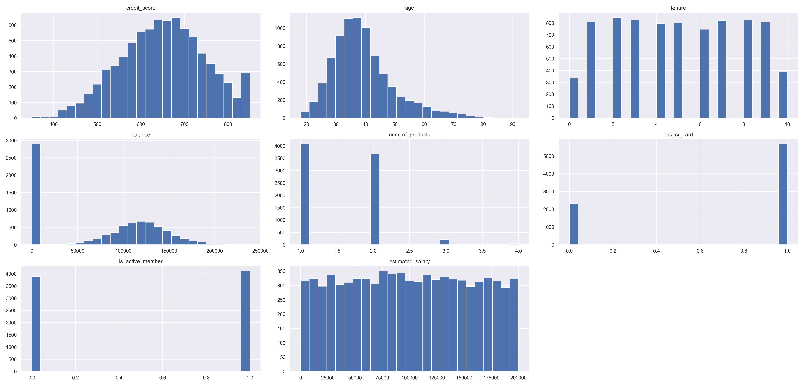

#### 2.2.2. Categorical Columns
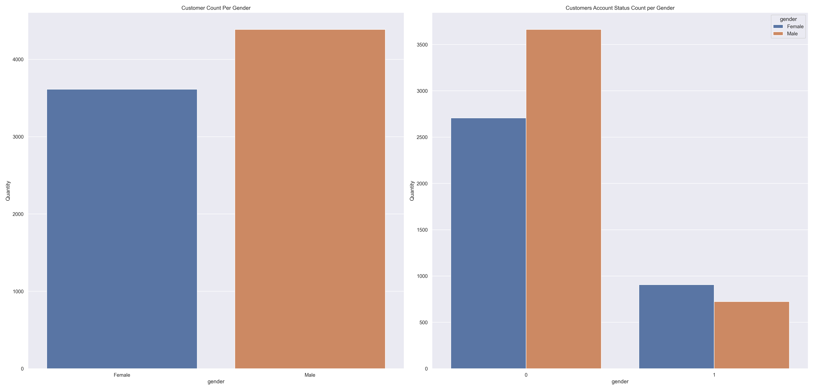

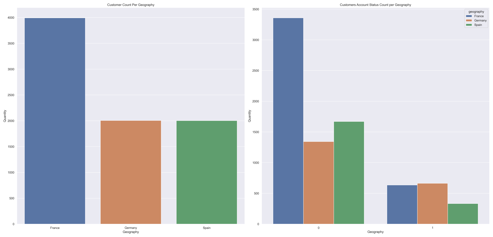

#### 2.2.3. Terget Column
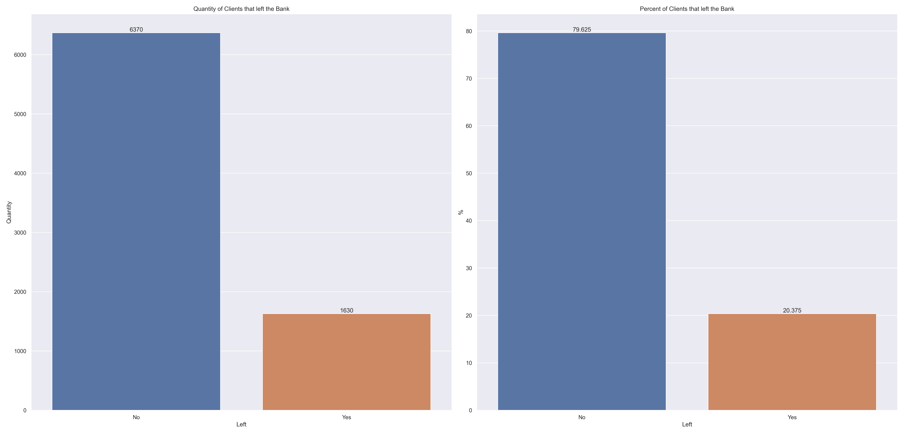

#### 2.2.4. Data Summary
The actual `Churn` rate from the bank is `20.375%`

Besides, we have the following analysis:
* `Balance`: About 25% of the observations have value equal to zero. Must be investigated to validate the possible outliers.
* `credit_score` feature has a spike around 850 points, with approximately 300 customers. Must be investigated to determine if these observations aren't outliers.
* `age` feature indicates that the bank customers are concentrated between 30 and 45 years
* `tenure` feature has around 300 customers with zero years. Theses observations must be investigated to better understand these customers
* `has_cr_card` feature indicates that the majority of the bank customers have a credit card
* `is_active_member` feature indicates the quantity of customers that are active and the customers that are not active are approximately the same
* `estimated_salary`: The graph shows that the distribution is partially uniform. It needs to be investigated.
* Most customers are men, but the customers who most left the bank the most are women
* Most customers are from France, but the customers who left the bank the most are from Germany

`credit_score`, `tenure`, `estimated_salaray` and `balance` will be investigated deeply in the next iteration.

## 3. Feature Engineering
### 3.1. Hypothesis Mind Map
Was created a Mind Map to help not only on the feature creation, but also to help create Business Hypothesis in order to guide EDA process.

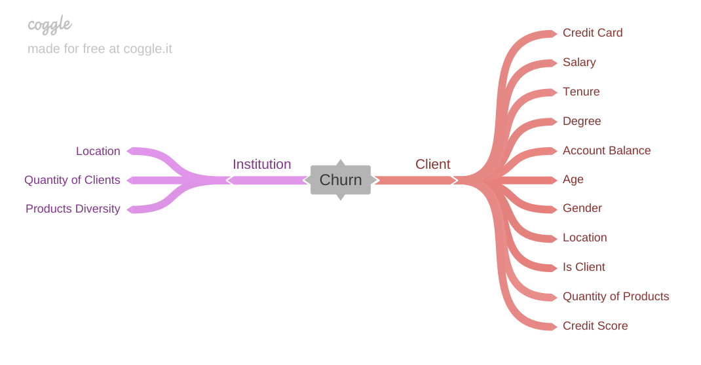

### 3.2. Feature Engineering
Were created 4 features:
* `credit_score_category`: feature created to categorize customers based on their credit score
* `estimated_monthly_salary`: feature created to calculate the customer's monthly income
* `products_used_year`: feature created to calculate how many products the customer use by year

### 3.3. Feature Filtering
Were filtered `row_number`, `costumer_id` and `surname` features, because they don't add any information relevance to the machine learning model.

## 4. EDA - Exploratory Data Analysis
### 4.1. Bivariate Analysis - Chosen Business Hypothesis

| Hypothesis                                                                                                          | Conclusion | Relevance |                                                |
| :------------------------------------------------------------------------------------------------------------------ | :--------- | :-------- | :--------------------------------------------: |
| **H1.** Customers with 4 years or less as bank customers are the largest number of active customers.                | FALSE      | Low       | 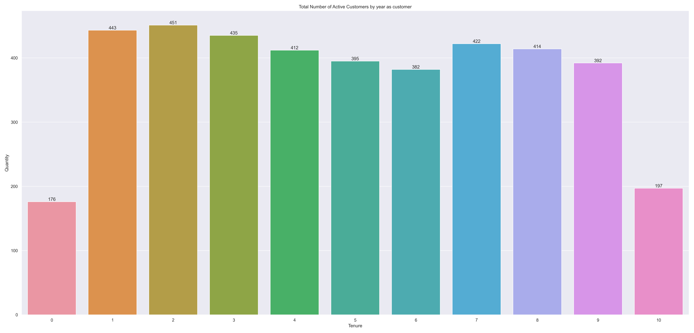  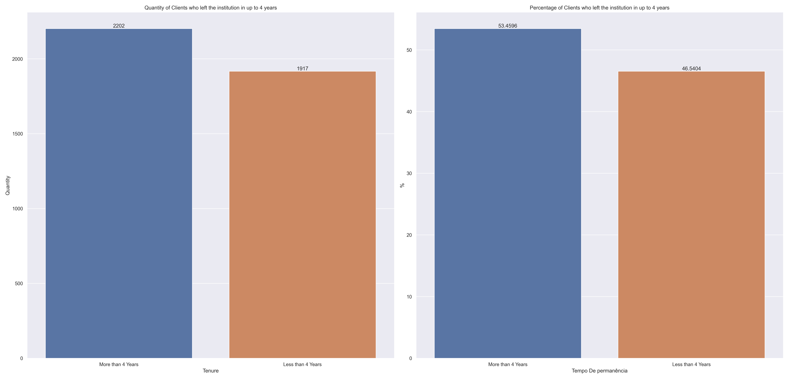 |
| **H3.** Customers that purchased 2 or more products from the bank are the majority of active customers.             | TRUE       | Low       |             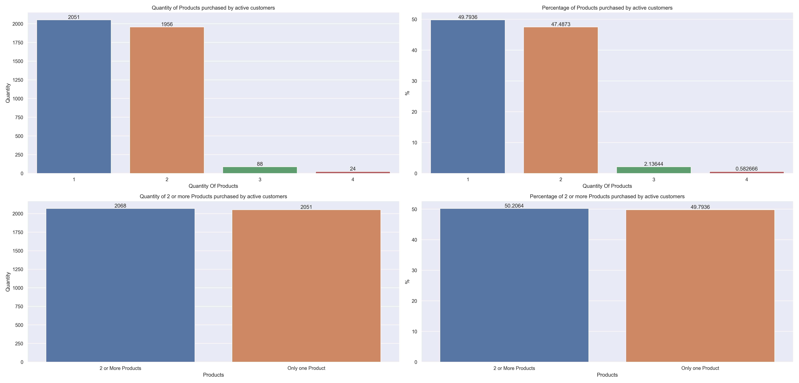             |
| **H5.** Customers with Credit Score above 650 points are the majority of customers that left the bank.              | FALSE      | High      |             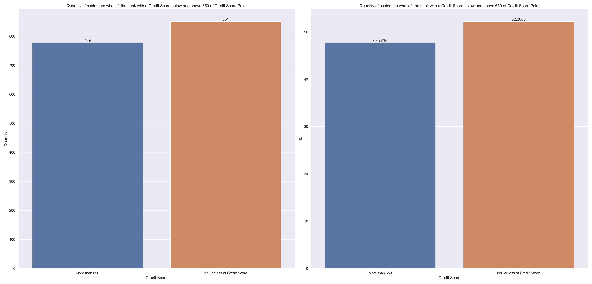             |
| **H7.** Customers who have a credit card are the majority of customers who have left the bank.                      | TRUE       | High      |             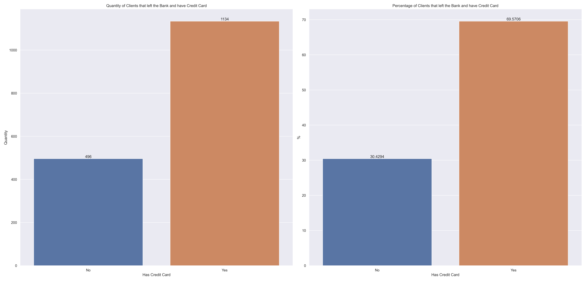             |
| **H8.** Male customers who have a credit card purchased more products than female customers who have a credit card. | TRUE       | Low       |             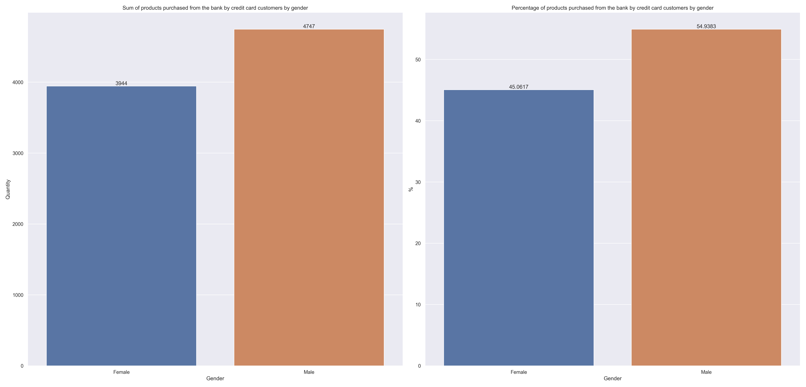             |

### 4.2. Multivariate Analysis
#### 4.2.1. Numerical Attributes
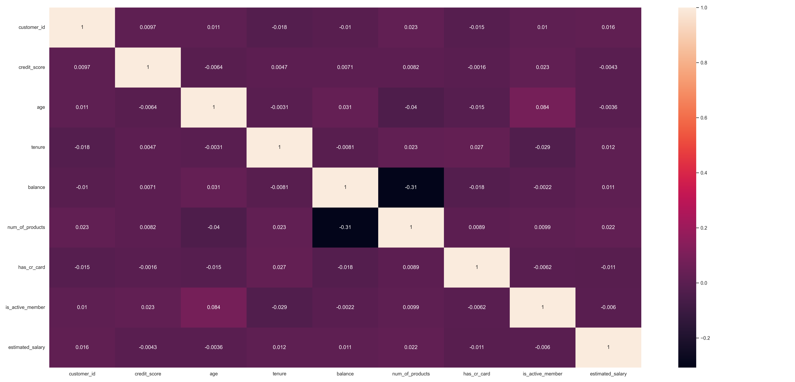

#### 4.2.2. Categorical Attributes
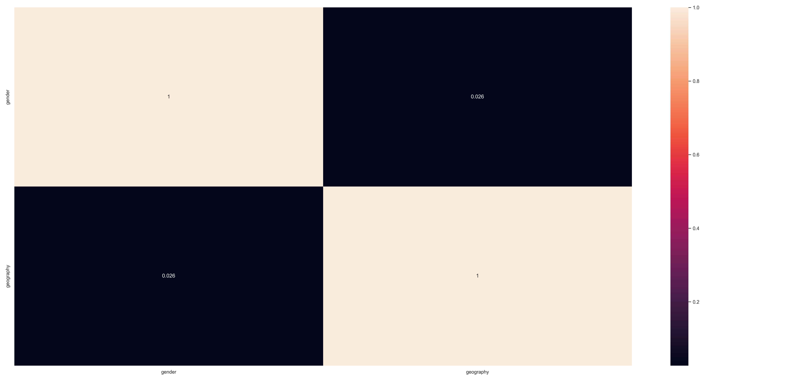

### 4.3. EDA Summary
* There are no significant linear correlation between the numerical features
* There are no significant correlation between the categorical feature.
* `credit_score` has a lot of significancy 

## 5. Data Preparation and Feature Selection
### 5.1. Data Preparation
For the numerical features, in this iteration, was used the Standard Scaler to rescale all features. In the next iteration, the `credit_score`, `tenure`, `estimated_salaray` and `balance` features will be investigated and, if outliers will be found, the Scaler could be changed.

For the categorical features, were used One Hot Encoding, to encode the `geography` and `gender` features because of their low cardinality.

### 5.2. Feature Selection
`row_number`, `costumer_id` and `surname` were already manualy filtered because of their low significance. In this iteration were used all features available. Besides, it was used Random Forest algorithm to help visualize feature importance. In the next iterations, it could be used another technique to select only the significant features, like RFE, PCA or Sequential Feature Selector.

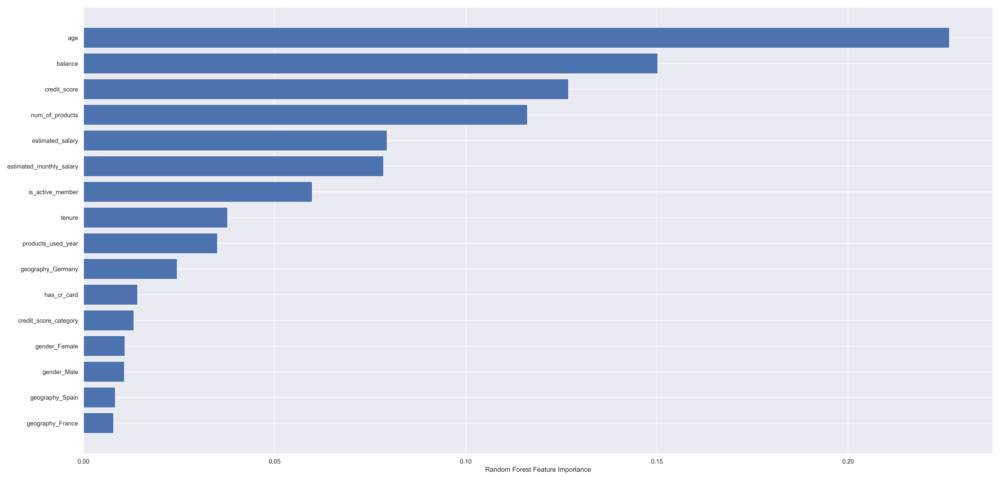

## 6. Machine Learning Model and Fine Tunning
### 6.1. Finding the Best Model and Hyperparameters
In order to find the best machine learning model and its hyperparameters, the Grid Search CV object was used with 4 Machine Learning Models:
* Logistic Regression
* Support Vector Classification (SVC)
* Random Forest
* XGBoost

Besides, it was created a Pipeline to process all Machine Learning Project stages, like transformations and encodings, in order to find the best model and hyperparameters. Also, the chosen metric was `roc_auc_score`.

The best machine learning model found was XGBoost with `0.86` `roc_auc_score`.

### 6.2. Training and Evaluating Chosen Model
It was created a Pipeline to make all preprocessing and training with the selected Machine Learning Model.

The trained model had a `roc_auc_score` of `0.884` with the training data and had a `roc_auc_score` of `0.861`with the test data.

### 6.3. Saving Model
To create the final model, it was created a new Pipeline that used all transformations and preprocessig pipelines to train a new model with all available data to train the chosen model, in order to help the model perform better with unseen data.

This new model was saved in the `models` directory with the `pickle` format.

### 6.4. Project availability preparation
In order to facilitate the project usage, it was created a Python script that will load the model saved on pickle, read the test csv file, execute the machine learning model with the new unseen test data and create a response csv file, with the unseen data classified.

## 7. How to Use this Project
In order to use this project, you need to execute these steps:
1. Create a Python virtual environment with Python's version 3.10
2. Install all packages and libraries inside `requirements.txt` using the `pip install -r requirements.txt` command
3. Replace the CSV file that is inside `data/test/` directory with the file that have the data you want to classify. The CSV file **MUST** have exactly the `abandono_teste.csv` name.
4. The CSV file with the classified clients will be placed inside the `data/answer/` directory, under the name `abandonos_{date}.csv`, where `{date}` will be the date of the execution.

## 8. Next Steps
In the next iterations, `credit_score`, `tenure`, `estimated_salaray` and `balance` features will be deeply investigated to better understand the data and verify the existence of outliers that could be filtered. 

Another thing that can be done is the creation of new features to enrich the data.

Besides, we can use feature selection techniques to choose the most relevant features, in order to increase the model score.

We can also answer the other business hypothesis to better understand the data and the features realations and create new hypothesis the verify other features relations.

[Back to top](#summary)

----